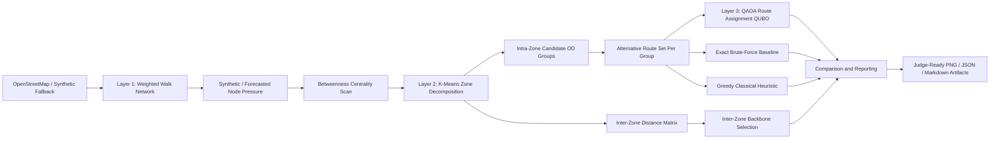

# Architecture Diagram

## Layer Summary

- Layer 1 builds a real, weighted walk network around Prayagraj.
- Layer 1 also injects forecasted pressure into edge weights before downstream routing benchmarks.
- Layer 2 compresses the graph into operational zones and derives local origin-destination cohorts.
- Layer 3 compares QAOA against exact and greedy classical baselines on a binary route-assignment problem inside each zone.
- The current architecture is a benchmark scaffold for local multi-group routing, not a finished city-scale crowd-flow optimizer.
